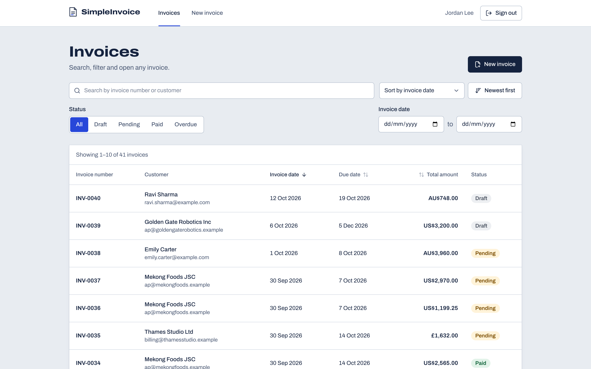
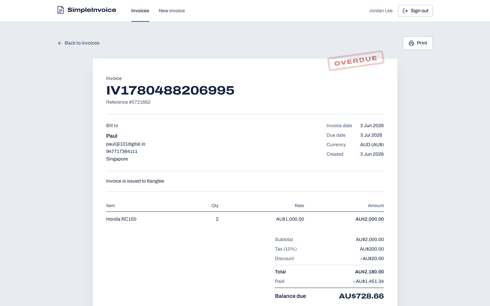

# SimpleInvoice

Invoicing app for the 101 Digital full-stack assessment (v2.3.1): a React + TypeScript frontend, a
NestJS + TypeScript API and PostgreSQL.

It has the four features from the assessment: sign-in, the invoice list (search, status filter,
sorting and server-side paging), the invoice detail page, and creating an invoice with one line
item. Totals are calculated by the API, and Overdue is worked out when invoices are read instead of
being stored.

| Invoice list                                       | Invoice detail                                         |
| -------------------------------------------------- | ------------------------------------------------------ |
|  |  |

## Running with Docker

All you need is Docker with Compose.

```sh
git clone <repository-url> simple-invoice
cd simple-invoice
docker compose up --build    # or: docker-compose up --build
```

The first build takes a few minutes. Then open http://localhost:8080 and sign in with the
[login below](#login). The API container runs the migrations and the seed when it starts, so there
are 41 invoices to look at straight away.

| Service    | Address                        |
| ---------- | ------------------------------ |
| Web app    | http://localhost:8080          |
| API        | http://localhost:4000          |
| Swagger UI | http://localhost:4000/api/docs |
| PostgreSQL | localhost:5433                 |

The ports are bound to 127.0.0.1 and can be changed with `FRONTEND_PORT`, `BACKEND_PORT` and
`POSTGRES_HOST_PORT`. Postgres is on 5433 so it doesn't clash with a local install. The web app's
nginx forwards `/api` to the API, so the browser only ever talks to port 8080.

You don't need a `.env` file, and there are no secrets in the repo. On first start the database
container generates a database password and a JWT signing key into a Docker volume, and the API
reads them from there. To change a setting, `cp .env.example .env` and edit it. Anything in `.env`
wins, including your own `POSTGRES_PASSWORD` and `JWT_SECRET`. The database applies a changed
`POSTGRES_PASSWORD` the next time it starts, so `.env` and the database never disagree.

```sh
docker compose up -d --build --wait   # start in the background and wait until healthy
docker compose down                   # stop; add -v to delete the data as well
```

## Login

| Email                      | Password       |
| -------------------------- | -------------- |
| `admin@simpleinvoice.test` | `Password123!` |

The seed creates this account from `SEED_USER_EMAIL` and `SEED_USER_PASSWORD`. Running the seed
again resets the password to the configured one, so this login keeps working.

## Running without Docker

You need Node.js 24 and PostgreSQL 14 or newer, with the `pg_trgm` extension (it ships with
Postgres; the migration enables it).

```sh
npm run setup          # creates .env with random secrets, then installs both apps
```

Then create the database user with the password that `npm run setup` wrote to `.env`:

```sql
CREATE USER simpleinvoice WITH PASSWORD '<POSTGRES_PASSWORD from .env>';
CREATE DATABASE simpleinvoice OWNER simpleinvoice;
```

The other database settings in `.env` already match this. Or skip this step and run only Postgres
in Docker: set `POSTGRES_PORT=5433` in `.env` and run `npm run dev:db`. It uses the password from
`.env`, also when the Docker stack has run before.

```sh
npm run seed           # runs the migrations, then seeds
npm run dev:backend    # API on http://localhost:4000
npm run dev:frontend   # web app on http://localhost:5173 (second terminal)
```

The Vite dev server proxies `/api` to the API the same way nginx does in Docker.

## Seeding

```sh
npm run seed                               # local
docker compose exec backend npm run seed   # Docker
```

The seed creates the login above, the Appendix A invoice exactly as given (same ids, customer, item
and amounts), and 40 generated invoices, `INV-0001` to `INV-0040`. The generated ones have a mix of
Draft, Pending and Paid, 13 customers, 7 currencies, different tax rates, discounts and partial
payments. Their dates are relative to the day you seed, so there are always some overdue, some
current and some upcoming invoices.

Appendix A shows its invoice as Overdue, but Overdue is not a stored status. It is saved as Pending
(it is partly paid and past due) and the API returns it as Overdue.

You can run the seed as often as you like. It skips invoice numbers that already exist and never
changes invoices created in the app.

## API

Every route except login, logout and health needs a JWT, either as `Authorization: Bearer <token>`
or through the cookie that login sets. In Swagger, call login, copy the `accessToken` and paste it
into Authorize.

| Method | Path            | Auth | Description                               |
| ------ | --------------- | ---- | ----------------------------------------- |
| POST   | `/auth/login`   | no   | Returns a JWT and sets the session cookie |
| GET    | `/auth/me`      | yes  | The signed-in user                        |
| POST   | `/auth/logout`  | no   | Clears the session cookie                 |
| GET    | `/invoices`     | yes  | List with search, filters, sort, paging   |
| GET    | `/invoices/:id` | yes  | Invoice detail                            |
| POST   | `/invoices`     | yes  | Create an invoice                         |
| GET    | `/health`       | no   | API and database health                   |

`GET /invoices` takes `page` (default 1), `pageSize` (1 to 100, default 10), `sortBy`
(`invoiceDate`, `dueDate` or `totalAmount`), `ordering` (`ASC` or `DESC`, default `DESC`),
`status` (`Draft`, `Pending`, `Paid` or `Overdue`), `keyword` (part of the invoice number or
customer name, any case) and `fromDate` / `toDate` (`YYYY-MM-DD`, inclusive, on the invoice date).
It returns `{ "data": [...], "paging": { "page", "pageSize", "total" } }`.

Creating an invoice with curl:

```sh
TOKEN=$(curl -s localhost:4000/auth/login -H 'Content-Type: application/json' \
  -d '{"email":"admin@simpleinvoice.test","password":"Password123!"}' \
  | node -pe 'JSON.parse(require("fs").readFileSync(0)).accessToken')

curl -s localhost:4000/invoices -H "Authorization: Bearer $TOKEN" -H 'Content-Type: application/json' -d '{
  "invoiceNumber": "INV-2026-0042", "invoiceDate": "2026-10-01", "dueDate": "2026-10-31", "currency": "AUD",
  "customer": { "fullname": "Paul", "email": "paul@101digital.io" },
  "items": [{ "name": "Honda RC150", "quantity": 2, "rate": 1000 }],
  "taxPercent": 10, "discount": 20 }'
```

The response is the new Draft invoice with `totalAmount` 2180.

Errors always have the same shape. Validation errors have one message per field, starting with the
field's path (`customer.email must be a valid email address`):

```json
{ "statusCode": 400, "message": ["dueDate must be on or after invoiceDate"], "error": "Bad Request" }
{ "statusCode": 404, "message": "Invoice not found", "error": "Not Found" }
```

Other status codes: 401 for a missing, invalid or expired token, 409 for a duplicate invoice
number, 415 for a request body that isn't JSON, 429 when login is rate limited, and 503 from
`/health` when the database is down.

## Architecture

```
backend/            NestJS API
  src/auth/         login, JWT strategy, global auth guard
  src/invoices/     controller, service, repository, DTOs, entities
    domain/         money and status rules (plain functions)
  src/database/     migration and seed
  src/common/       exception filter, validation, clock, logging
  src/config/       environment validation
  test/             API tests against a real PostgreSQL (Testcontainers)
  tools/diagrams/   generates docs/diagrams
frontend/           React app (Vite)
  src/features/     auth and invoices: pages, components, API hooks
  src/components/   layout and shared UI
  src/lib/          API client, types, formatting
  e2e/              Playwright smoke test
  nginx/            serves the app and proxies /api
database/           PostgreSQL image; generates the secrets on first start
docs/diagrams/      Mermaid diagrams generated from the code
docker-compose.yml
```

It's one repo so everything starts with one command, but each app has its own `package.json`,
lockfile and Dockerfile. The root `package.json` only has convenience scripts.

In the API, a global guard requires a JWT on every route that isn't marked `@Public()`, a global
ValidationPipe (class-validator) checks every request, and a global exception filter formats every
error. Controllers are thin, the service holds the use cases, the repository builds the list query,
and the money and status rules are plain functions with their own tests.

The frontend uses React Router, TanStack Query for server data, React Hook Form with Zod for the
create form, and Tailwind. The list's search, filters, sort and page live in the URL, so refreshing,
the back button and shared links all show the same view.

## Diagrams

`docs/diagrams/` has Mermaid diagrams generated from the code. GitHub renders them in place.

- [API spec](docs/diagrams/api-spec.md): endpoints and schemas, from the OpenAPI document
- [Architecture](docs/diagrams/architecture.md): the containers (from `docker-compose.yml` and the
  Dockerfiles), the Nest modules and providers, and the web app routes
- [Sequence diagrams](docs/diagrams/sequence-diagrams.md): one per endpoint, traced through the
  TypeScript source from the guards down to the database, with the errors that the guards, pipes
  and handlers return
- [Data dictionary](docs/diagrams/data-dictionary.md): an ER diagram and every table, column,
  constraint and index, read from PostgreSQL after the migrations have run

```sh
npm run diagrams    # regenerates them, needs Docker
```

On every pull request the Diagrams workflow (`.github/workflows/diagrams.yml`) regenerates them and
keeps one comment up to date with the sections that changed, each rendered with its source diff. A
pull request that changes no diagram gets no comment (or, if an earlier push got one, an update
saying so). The job fails when the committed `docs/diagrams` doesn't match the code. It checks the
merge with the base branch, so once another pull request has changed the diagrams, bring the branch
up to date and regenerate them. Pull requests from forks only get a read-only token, so for those
the changes go to the job summary instead.

## Design decisions and assumptions

### Data model

- The customer's details are stored on the invoice rather than in a customers table. An issued
  invoice should keep the details it was issued with.
- Line items have their own table. The API takes an `items` array, as in Appendix A, but only
  accepts one item as the assessment asks.
- `taxPercent` is stored too, so the detail page can show the rate and the totals can be checked.
- The database enforces the important rules as well: unique invoice numbers (ignoring case), due
  date on or after the invoice date, no negative amounts, and `total = subtotal + tax - discount`.
- Trigram indexes keep the `ILIKE '%keyword%'` search fast.

### Money

- Amounts are only calculated in the API, with decimal.js instead of floating point. Subtotal, tax
  and total are each rounded half-up to the cent.
- The discount is an amount, not a percentage (Appendix A: 2000 + 200 - 20 = 2180), and it can't be
  more than subtotal plus tax.
- Amounts are `numeric(15,2)` in the database and JSON numbers in the API, like in Appendix A. The
  input limits keep every amount within 15 significant digits, so the conversion never loses a cent.
- Only currencies with two decimal places are offered.

### Status and dates

- Overdue is never stored. An invoice is Overdue when it isn't Paid and its due date is before
  today. That includes Drafts, following the rule in the assessment. An invoice due today isn't
  overdue yet.
- The status filter applies the same rule in SQL, so filtering by Pending doesn't return overdue
  invoices and the paging totals match the rows.
- "Today" is the date in `APP_TIMEZONE`, which defaults to UTC.

### Invoices and API

- Invoice numbers are typed in by the user and must be unique, ignoring case. A unique index
  decides, so two requests with the same number at the same moment get one 201 and one 409.
- New invoices are always Draft. Clients can't send a status, totals or any unknown field.
- `taxPercent` and `discount` can be left out (they default to 10 and 0) but can't be `null`.
- The routes are exactly as listed in the assessment, without an `/api` prefix. The web app calls
  them under `/api`, which nginx strips before passing the request on.
- The list is sorted by the chosen field, then by newest, then by id, so pages never overlap.

### Authentication

- The browser keeps the JWT in an HttpOnly, SameSite=Strict cookie, so scripts can't read it.
  Login also returns the token for API clients and Swagger. Tokens expire after `JWT_EXPIRES_IN`
  seconds (default 3600).
- Passwords are hashed with bcrypt, and a wrong email gets the same response as a wrong password.
- Login is rate limited per IP and per account.
- Signed-out users are sent to the login page and back to the page they wanted after signing in.

## Testing

```sh
npm test            # unit and component tests (Jest for the API, Vitest for the frontend)
npm run test:e2e    # API tests against a real PostgreSQL, needs Docker
npm run lint && npm run typecheck
```

- API unit tests cover the money calculation (including Appendix A and rounding), Overdue, the date
  rules, request validation and the seed generator.
- API end-to-end tests run against PostgreSQL in a container. They cover creating an invoice and
  finding it in the list and detail, duplicate numbers (also sent at the same time), filters,
  search, sorting, paging, auth and the seed. Set `TEST_DATABASE_URL` to a database whose name ends
  in `_test` to use your own Postgres instead.
- Frontend tests (Vitest, Testing Library, MSW) cover route protection, login, the list and its URL
  state, the create form and its errors, and the detail page.
- The diagram generator has unit tests for each diagram, for the source tracing (against a small
  fixture app in `backend/tools/diagrams/fixtures`) and for the pull request comment.
- A Playwright smoke test signs in, creates an invoice, finds it, opens it and signs out, against
  the running Docker stack. It leaves invoices named `E2E-...` behind (`docker compose down -v`
  clears them).

  ```sh
  npx --prefix frontend playwright install chromium   # or set E2E_BROWSER_CHANNEL=chrome
  npm run test:browser
  ```

CI runs all of the above on pushes to main and on pull requests (`.github/workflows/ci.yml`).

## Configuration

All configuration comes from environment variables, read from `.env`. `.env.example` lists every
variable with a short comment, with the secrets left empty. The API checks its configuration on
startup and stops with a clear message if something is missing or wrong, for example a
`JWT_SECRET` shorter than 32 characters.

The ones you are most likely to change:

- `FRONTEND_PORT`, `BACKEND_PORT`, `POSTGRES_HOST_PORT`
- `POSTGRES_HOST`, `POSTGRES_PORT`, `POSTGRES_USER`, `POSTGRES_PASSWORD`, `POSTGRES_DB`
- `JWT_SECRET`, `JWT_EXPIRES_IN`
- `POSTGRES_PASSWORD_FILE`, `JWT_SECRET_FILE`, to read a secret from a file (Docker uses these)
- `APP_TIMEZONE`, which decides when an invoice becomes overdue
- `SEED_USER_EMAIL`, `SEED_USER_PASSWORD`, `SEED_USER_FULLNAME`
- `COOKIE_SECURE=true` when the app is served over HTTPS

## Known limitations

- You can't change an invoice's status, record a payment, edit or delete an invoice, add more than
  one item, register or reset a password. None of this was in the assessment. The seed includes
  Pending and Paid invoices to show those states.
- Logout clears the cookie but doesn't revoke the token, so a copied token works until it expires.
  There are no refresh tokens.
- Every signed-in user sees every invoice. There are no roles or tenants.
- Currencies without decimal places (JPY, VND) aren't supported because amounts have two decimals.
- CSRF protection relies on the SameSite=Strict cookie and JSON-only request bodies. That's fine
  for a single origin, but a setup spread over several subdomains would need a CSRF token.
- The login rate limit is kept in memory, so it is per API instance. It counts every attempt,
  successful or not, per IP address and per account (`LOGIN_RATE_LIMIT`, 10 a minute), so repeated
  failed logins lock that account out for a minute.
- The Docker setup is for local review: plain HTTP, a public demo password, and the API port open
  for Swagger. A real deployment should change the demo password, use HTTPS with
  `COOKIE_SECURE=true`, and only expose the API through the proxy.

## Extras

Things I added on top of the requirements:

- Generated secrets, so a fresh clone runs without any secret in the repo
- A session cookie, logout, and a "session expired" message
- Rate-limited login, security headers, and no caching of API responses
- JSON logs with a request id, leaving out bodies, tokens and query strings
- A responsive layout, a printable invoice page, and keyboard and screen-reader support
- API tests against a real Postgres, a Playwright smoke test and CI
- Diagrams generated from the code, with a pull request comment whenever one changes
