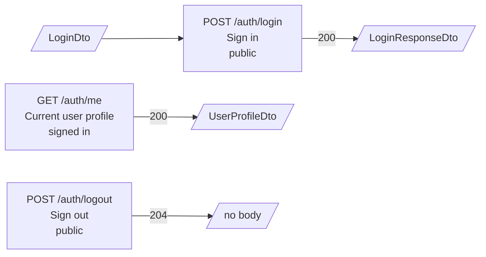
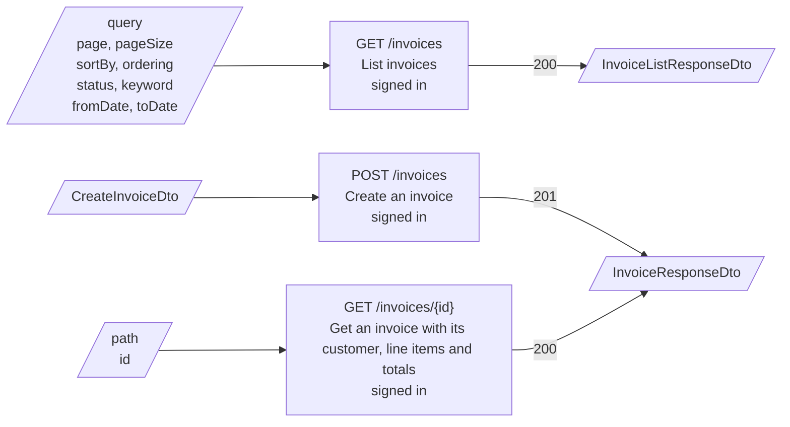
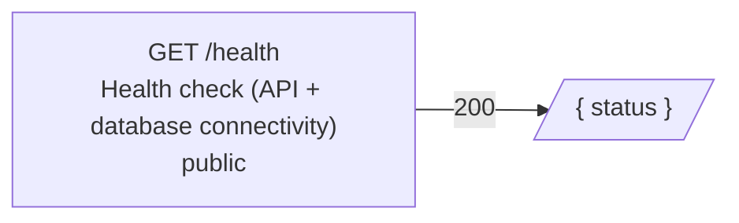
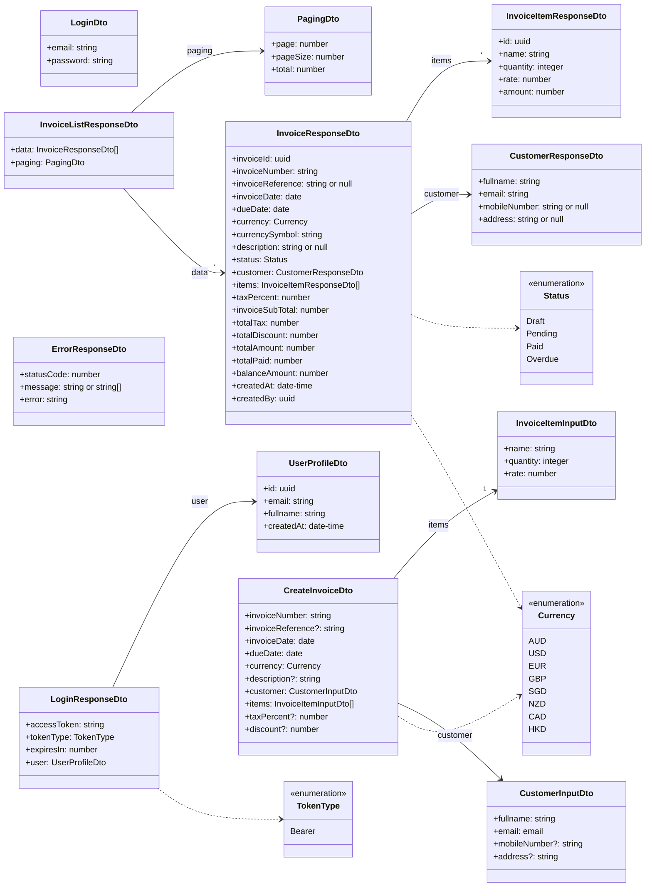

<!-- Generated by `npm run diagrams`. Edit the code it is read from, not this file. -->

# API spec

SimpleInvoice API 1.0.0, from the OpenAPI document the API serves (Swagger UI at `/api/docs`, JSON at `/api/docs-json`).

## Authentication

Endpoints marked "signed in" accept any one of these. The others are public.

| Scheme   | Sent as                              |
| -------- | ------------------------------------ |
| `bearer` | `Authorization: Bearer <JWT>` header |
| `cookie` | `access_token` cookie                |

## Auth endpoints

| Endpoint            | Summary              | Access    | Request         | Responses                                                                                                                          |
| ------------------- | -------------------- | --------- | --------------- | ---------------------------------------------------------------------------------------------------------------------------------- |
| `POST /auth/login`  | Sign in              | public    | body `LoginDto` | 200 `LoginResponseDto` 400 Invalid email or missing password. 401 Invalid email or password. 429 Too many login attempts. |
| `GET /auth/me`      | Current user profile | signed in |                 | 200 `UserProfileDto` 401 Missing, invalid or expired token.                                                                     |
| `POST /auth/logout` | Sign out             | public    |                 | 204 no body                                                                                                                        |

## Invoices endpoints

| Endpoint             | Summary                                                 | Access    | Request                                                                                   | Responses                                                                                                                          |
| -------------------- | ------------------------------------------------------- | --------- | ----------------------------------------------------------------------------------------- | ---------------------------------------------------------------------------------------------------------------------------------- |
| `GET /invoices`      | List invoices                                           | signed in | query `page`, `pageSize`, `sortBy`, `ordering`, `status`, `keyword`, `fromDate`, `toDate` | 200 `InvoiceListResponseDto` 400 Invalid query parameters. 401 Missing, invalid or expired token.                            |
| `POST /invoices`     | Create an invoice                                       | signed in | body `CreateInvoiceDto`                                                                   | 201 `InvoiceResponseDto` 400 Validation failed. 401 Missing, invalid or expired token. 409 Invoice number already exists. |
| `GET /invoices/{id}` | Get an invoice with its customer, line items and totals | signed in | path `id`                                                                                 | 200 `InvoiceResponseDto` 400 id is not a valid UUID. 401 Missing, invalid or expired token. 404 Invoice not found.        |

| Endpoint             | Parameter  | In    | Type    | Required | Default       | Description                                                                           | Rules                                          |
| -------------------- | ---------- | ----- | ------- | -------- | ------------- | ------------------------------------------------------------------------------------- | ---------------------------------------------- |
| `GET /invoices`      | `page`     | query | integer | no       | `1`           |                                                                                       | At least 1, at most 100000                     |
| `GET /invoices`      | `pageSize` | query | integer | no       | `10`          |                                                                                       | At least 1, at most 100                        |
| `GET /invoices`      | `sortBy`   | query | string  | no       | `invoiceDate` |                                                                                       | One of `invoiceDate`, `dueDate`, `totalAmount` |
| `GET /invoices`      | `ordering` | query | string  | no       | `DESC`        |                                                                                       | One of `ASC`, `DESC`                           |
| `GET /invoices`      | `status`   | query | string  | no       |               | Filters on the effective status, so Overdue invoices are not listed as Draft/Pending. | One of `Draft`, `Pending`, `Paid`, `Overdue`   |
| `GET /invoices`      | `keyword`  | query | string  | no       |               | Case-insensitive partial match on invoice number or customer name.                    | Up to 100 characters                           |
| `GET /invoices`      | `fromDate` | query | date    | no       |               | Invoices dated on/after (YYYY-MM-DD).                                                 |                                                |
| `GET /invoices`      | `toDate`   | query | date    | no       |               | Invoices dated on/before (YYYY-MM-DD).                                                |                                                |
| `GET /invoices/{id}` | `id`       | path  | uuid    | yes      |               | The invoiceId.                                                                        |                                                |

## Health endpoints

| Endpoint      | Summary                                    | Access | Request | Responses                                     |
| ------------- | ------------------------------------------ | ------ | ------- | --------------------------------------------- |
| `GET /health` | Health check (API + database connectivity) | public |         | 200 `{ status }` 503 Database unavailable. |

## Schemas

Request and response bodies. `?` marks an optional field.

