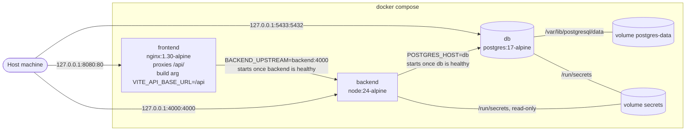
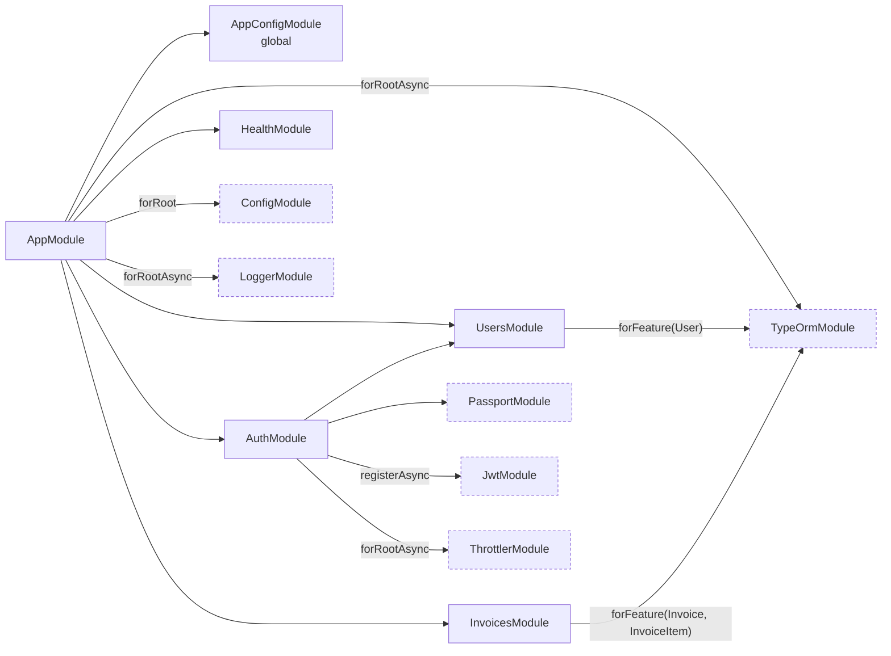
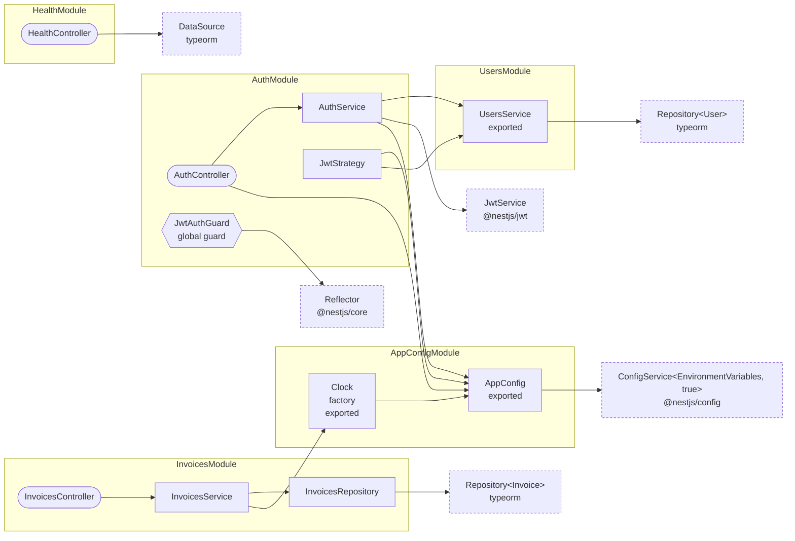
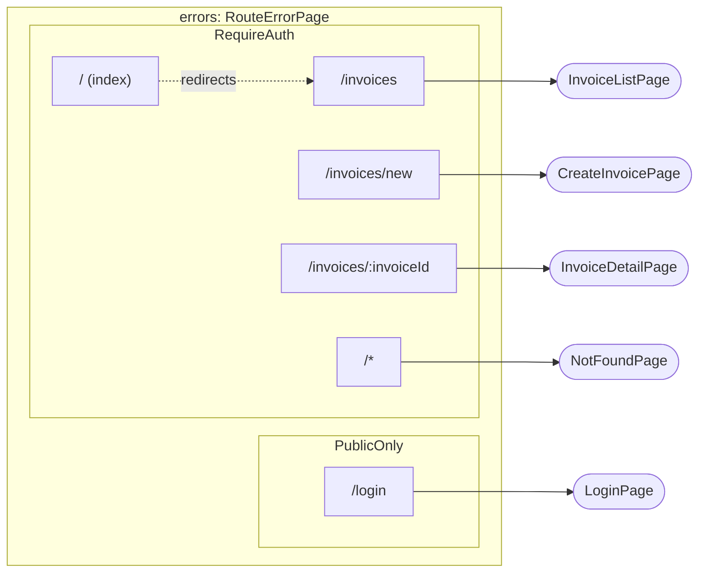

<!-- Generated by `npm run diagrams`. Edit the code it is read from, not this file. -->

# Architecture

Read from `docker-compose.yml` and the Dockerfiles, the Nest module metadata and constructors, and the web app route table.

## Containers

`docker compose up` with no `.env`. Edge labels on the left are published ports (host address, host port, container port).

## API modules

Nest modules and what each one imports. Dashed boxes are library modules.

## API providers

Controllers and providers in each module, with an arrow to everything their constructor injects. Dashed boxes come from libraries.

## Web app routes

From `frontend/src/app/routes.tsx`. Boxes around routes are layout routes: the guard or error boundary that wraps them.

