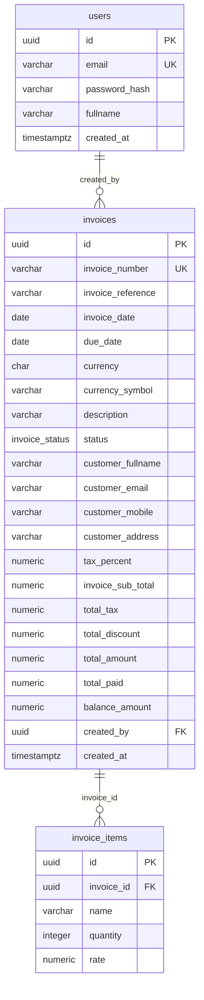

<!-- Generated by `npm run diagrams`. Edit the code it is read from, not this file. -->

# Data dictionary

The PostgreSQL schema, read from the database catalog after the API has started against an empty database and run its migrations.

## Entity relationship diagram

## invoice_items

| Column       | Type                     | Nullable | Default             | Notes                    |
| ------------ | ------------------------ | -------- | ------------------- | ------------------------ |
| `id`         | `uuid`                   | no       | `gen_random_uuid()` | primary key              |
| `invoice_id` | `uuid`                   | no       |                     | references `invoices.id` |
| `name`       | `character varying(200)` | no       |                     |                          |
| `quantity`   | `integer`                | no       |                     |                          |
| `rate`       | `numeric(12,2)`          | no       |                     |                          |

| Constraint                  | Kind        | Definition                                                           |
| --------------------------- | ----------- | -------------------------------------------------------------------- |
| `invoice_items_pkey`        | primary key | `PRIMARY KEY (id)`                                                   |
| `fk_invoice_items_invoice`  | foreign key | `FOREIGN KEY (invoice_id) REFERENCES invoices(id) ON DELETE CASCADE` |
| `ck_invoice_items_quantity` | check       | `CHECK ((quantity > 0))`                                             |
| `ck_invoice_items_rate`     | check       | `CHECK ((rate > (0)::numeric))`                                      |

| Index                         | Unique | Definition           |
| ----------------------------- | ------ | -------------------- |
| `ix_invoice_items_invoice_id` | no     | `btree (invoice_id)` |

## invoices

| Column              | Type                       | Nullable | Default                   | Notes                                 |
| ------------------- | -------------------------- | -------- | ------------------------- | ------------------------------------- |
| `id`                | `uuid`                     | no       | `gen_random_uuid()`       | primary key                           |
| `invoice_number`    | `character varying(50)`    | no       |                           | unique (`uq_invoices_invoice_number`) |
| `invoice_reference` | `character varying(100)`   | yes      |                           |                                       |
| `invoice_date`      | `date`                     | no       |                           |                                       |
| `due_date`          | `date`                     | no       |                           |                                       |
| `currency`          | `character(3)`             | no       |                           |                                       |
| `currency_symbol`   | `character varying(8)`     | no       |                           |                                       |
| `description`       | `character varying(1000)`  | yes      |                           |                                       |
| `status`            | `invoice_status`           | no       | `'Draft'::invoice_status` |                                       |
| `customer_fullname` | `character varying(120)`   | no       |                           |                                       |
| `customer_email`    | `character varying(254)`   | no       |                           |                                       |
| `customer_mobile`   | `character varying(30)`    | yes      |                           |                                       |
| `customer_address`  | `character varying(255)`   | yes      |                           |                                       |
| `tax_percent`       | `numeric(5,2)`             | no       | `10`                      |                                       |
| `invoice_sub_total` | `numeric(15,2)`            | no       |                           |                                       |
| `total_tax`         | `numeric(15,2)`            | no       |                           |                                       |
| `total_discount`    | `numeric(15,2)`            | no       | `0`                       |                                       |
| `total_amount`      | `numeric(15,2)`            | no       |                           |                                       |
| `total_paid`        | `numeric(15,2)`            | no       | `0`                       |                                       |
| `balance_amount`    | `numeric(15,2)`            | no       |                           |                                       |
| `created_by`        | `uuid`                     | no       |                           | references `users.id`                 |
| `created_at`        | `timestamp with time zone` | no       | `now()`                   |                                       |

| Constraint                             | Kind        | Definition                                                                                                                                                                                                                    |
| -------------------------------------- | ----------- | ----------------------------------------------------------------------------------------------------------------------------------------------------------------------------------------------------------------------------- |
| `invoices_pkey`                        | primary key | `PRIMARY KEY (id)`                                                                                                                                                                                                            |
| `fk_invoices_created_by`               | foreign key | `FOREIGN KEY (created_by) REFERENCES users(id) ON DELETE RESTRICT`                                                                                                                                                            |
| `ck_invoices_amounts_non_negative`     | check       | `CHECK (((invoice_sub_total >= (0)::numeric) AND (total_tax >= (0)::numeric) AND (total_discount >= (0)::numeric) AND (total_amount >= (0)::numeric) AND (total_paid >= (0)::numeric) AND (balance_amount >= (0)::numeric)))` |
| `ck_invoices_balance_amount`           | check       | `CHECK ((balance_amount = (total_amount - total_paid)))`                                                                                                                                                                      |
| `ck_invoices_currency`                 | check       | `CHECK ((currency ~ '^[A-Z]{3}$'::text))`                                                                                                                                                                                     |
| `ck_invoices_due_date`                 | check       | `CHECK ((due_date >= invoice_date))`                                                                                                                                                                                          |
| `ck_invoices_invoice_number_not_blank` | check       | `CHECK ((btrim((invoice_number)::text) <> ''::text))`                                                                                                                                                                         |
| `ck_invoices_tax_percent`              | check       | `CHECK (((tax_percent >= (0)::numeric) AND (tax_percent <= (100)::numeric)))`                                                                                                                                                 |
| `ck_invoices_total_amount`             | check       | `CHECK ((total_amount = ((invoice_sub_total + total_tax) - total_discount)))`                                                                                                                                                 |

| Index                                | Unique | Definition                              |
| ------------------------------------ | ------ | --------------------------------------- |
| `ix_invoices_created_by`             | no     | `btree (created_by)`                    |
| `ix_invoices_customer_fullname_trgm` | no     | `gin (customer_fullname gin_trgm_ops)`  |
| `ix_invoices_due_date`               | no     | `btree (due_date)`                      |
| `ix_invoices_invoice_date`           | no     | `btree (invoice_date)`                  |
| `ix_invoices_invoice_number_trgm`    | no     | `gin (invoice_number gin_trgm_ops)`     |
| `ix_invoices_status_due_date`        | no     | `btree (status, due_date)`              |
| `ix_invoices_total_amount`           | no     | `btree (total_amount)`                  |
| `uq_invoices_invoice_number`         | yes    | `btree (lower((invoice_number)::text))` |

## users

| Column          | Type                       | Nullable | Default             | Notes                     |
| --------------- | -------------------------- | -------- | ------------------- | ------------------------- |
| `id`            | `uuid`                     | no       | `gen_random_uuid()` | primary key               |
| `email`         | `character varying(254)`   | no       |                     | unique (`uq_users_email`) |
| `password_hash` | `character varying(100)`   | no       |                     |                           |
| `fullname`      | `character varying(120)`   | no       |                     |                           |
| `created_at`    | `timestamp with time zone` | no       | `now()`             |                           |

| Constraint                 | Kind        | Definition                                       |
| -------------------------- | ----------- | ------------------------------------------------ |
| `users_pkey`               | primary key | `PRIMARY KEY (id)`                               |
| `uq_users_email`           | unique      | `UNIQUE (email)`                                 |
| `ck_users_email_lowercase` | check       | `CHECK (((email)::text = lower((email)::text)))` |

## Types and extensions

| Enum type        | Values                     |
| ---------------- | -------------------------- |
| `invoice_status` | `Draft`, `Pending`, `Paid` |

Extensions: `pg_trgm`, `uuid-ossp`.
