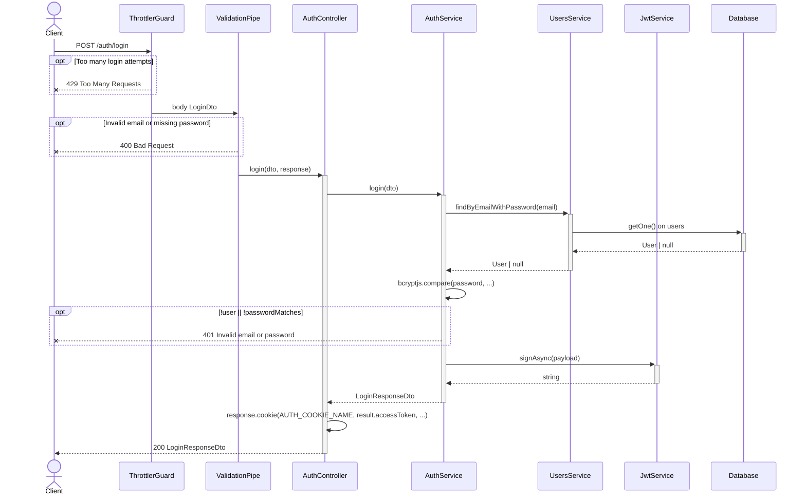
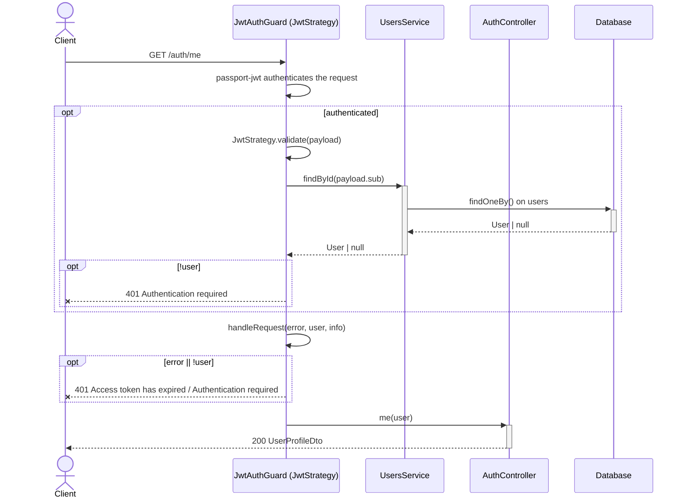
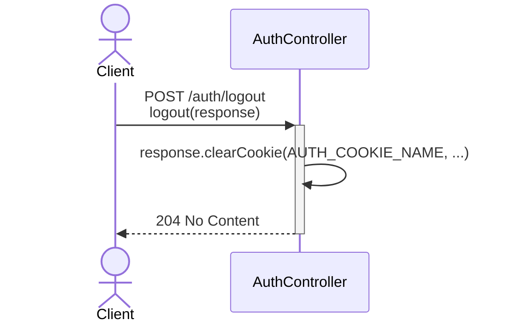
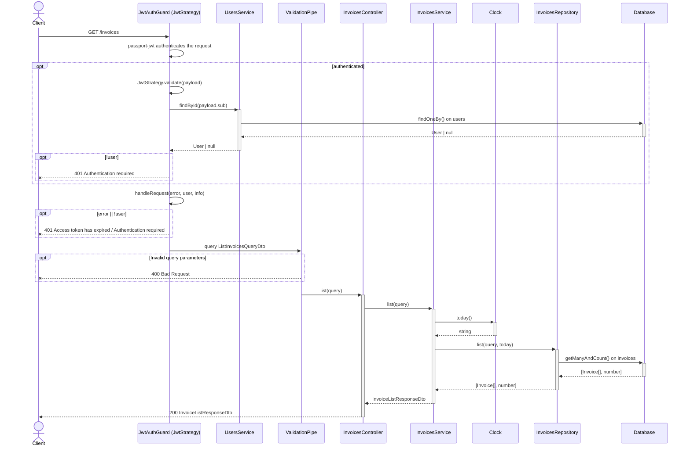
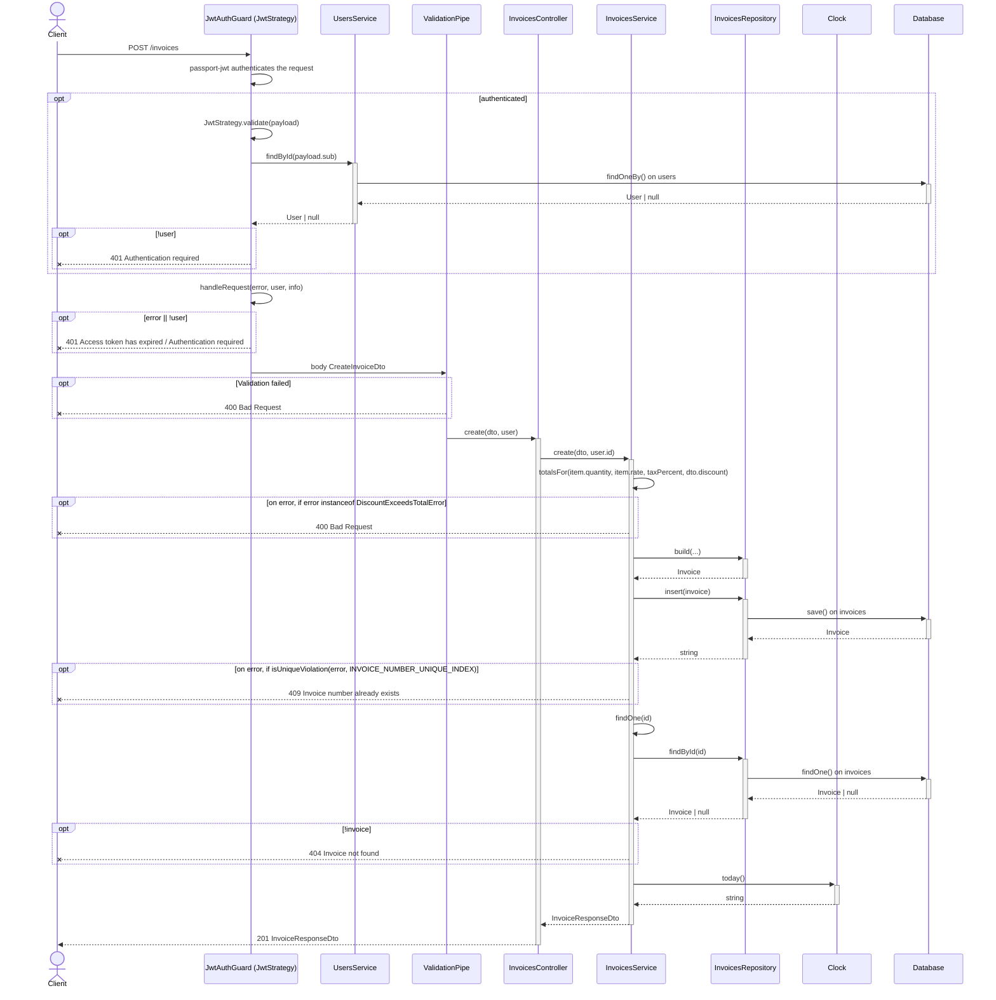
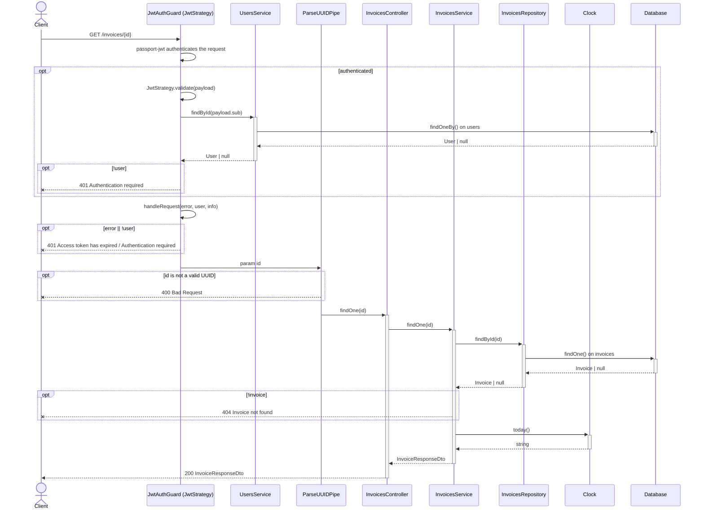
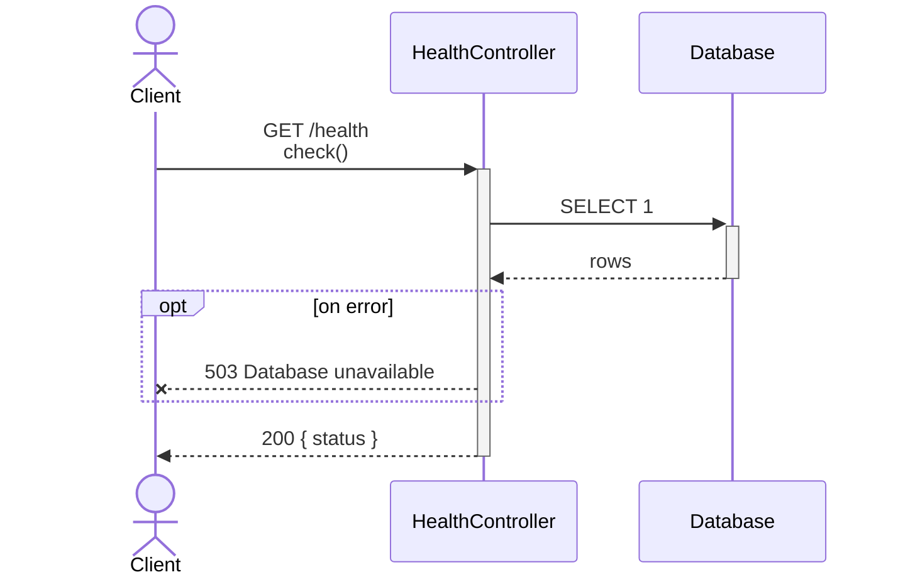

<!-- Generated by `npm run diagrams`. Edit the code it is read from, not this file. -->

# Sequence diagrams

One per endpoint, traced through the TypeScript source: the guards and pipes Nest runs first, then every call from the controller down to the database. Each branch in a guard, pipe or handler that ends in an HTTP error is drawn (arrows ending in x), not only the success path. Errors from before the guards, such as 415 for a body that isn't JSON, are left out.

## POST /auth/login

Handled by `AuthController.login` in `backend/src/auth/auth.controller.ts`.

## GET /auth/me

Handled by `AuthController.me` in `backend/src/auth/auth.controller.ts`.

## POST /auth/logout

Handled by `AuthController.logout` in `backend/src/auth/auth.controller.ts`.

## GET /invoices

Handled by `InvoicesController.list` in `backend/src/invoices/invoices.controller.ts`.

## POST /invoices

Handled by `InvoicesController.create` in `backend/src/invoices/invoices.controller.ts`.

## GET /invoices/{id}

Handled by `InvoicesController.findOne` in `backend/src/invoices/invoices.controller.ts`.

## GET /health

Handled by `HealthController.check` in `backend/src/health/health.controller.ts`.

